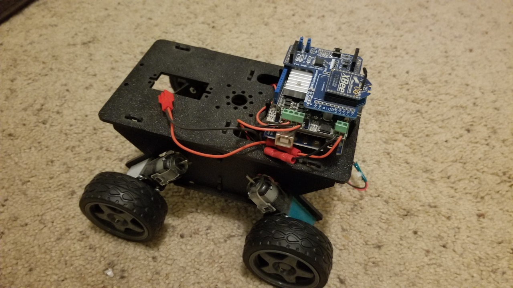

# rover
Arduino sketch to use an arduino, a motor shield and a xbee shield to drive an actobotics runt rover.  With another xbee connected to a PC you can send
characters to control the motor shield.

The repo also has a LabVIEW VI that can be used instead of the keyboard to send the characters.  The VI can be opened in LV 2011 or later.

